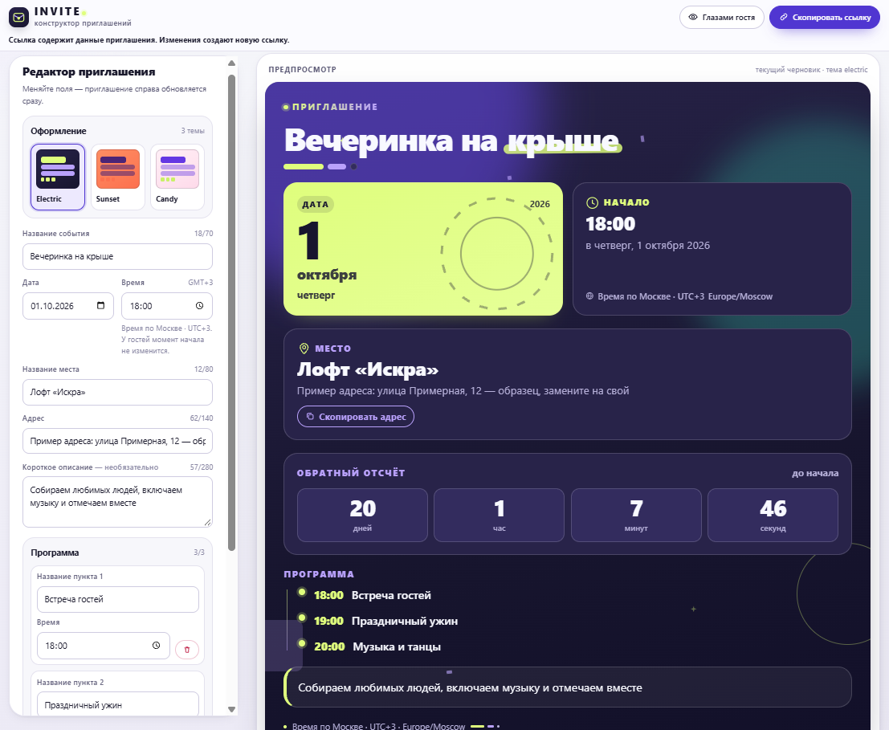

# INVITE

**Яркие онлайн-приглашения с живым предпросмотром.**

Выбери оформление, добавь детали события и отправь гостям ссылку на приглашение.

**[Открыть демо ↗](https://ramilnramis-prog.github.io/invite/)**

HTML · CSS · JavaScript · SVG

INVITE собирает название, дату, время, место и программу события в одну афишу. Предпросмотр обновляется во время редактирования, а гостевой режим показывает готовое приглашение.

- **Три оформления:** Electric, Sunset и Candy.
- **Инфографика события:** календарная дата, время начала, место и обратный отсчёт.
- **Программа:** до трёх пунктов с временем и описанием.
- **Гостевая ссылка:** приглашение открывается по отдельной ссылке с его данными.
- **Локальный черновик:** введённые данные сохраняются в браузере автора.
- **Копирование адреса:** действие прямо на карточке места.

Чтобы попробовать проект:

1. Открой [демо](https://ramilnramis-prog.github.io/invite/) и выбери тему.
2. Заполни название события, дату, время, место и адрес. При желании добавь описание и программу.
3. Нажми «Глазами гостя», затем «Скопировать ссылку» и отправь приглашение.

Приложение целиком находится в `index.html`: разметка, стили, логика и SVG-графика. Сборка и установка зависимостей не требуются. Данные приглашения кодируются в URL-фрагменте, а черновик хранится в `localStorage`. Для времени события используются ISO UTC и IANA-пояс.

Для локального запуска скачай `index.html` и открой его в браузере. Для отправки гостевых ссылок используй опубликованную версию. Демо размещено на GitHub Pages.
